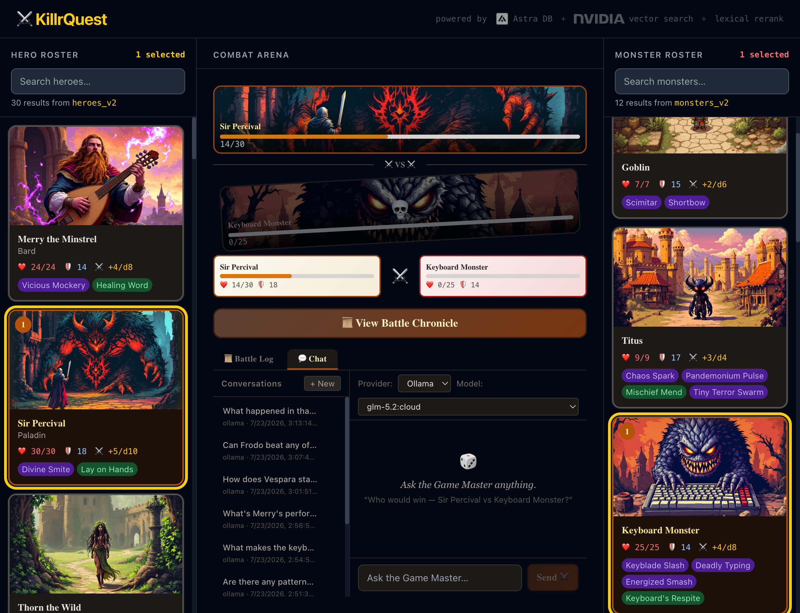

<h1 style="display: flex; align-items: center; justify-content: space-between;">
  <span>KillrQuest</span>
  <span> Astra DB</span>
</h1>

A fantasy battle sandbox with a dramatic AI game master, searchable hero and monster rosters, and a battle chronicle that remembers what happened.

KillrQuest lets you assemble a party, unleash a monster squad, and watch the clash play out in style. It is part searchable codex, part auto-battler, part tavern storyteller.

## What it does

- Search **heroes** and **monsters** with semantic vector search.
- Build custom rosters for both sides of the arena.
- Run animated battles with logs, outcomes, and surviving HP.
- Open the in-app **Chat** tab to ask the KillrQuest Game Master about heroes, monsters, and past battles.
- Save battle history so the app can reference earlier matchups and outcomes.

> Pick your champions. Summon your horrors. Let the database decide their fate.

## Screenshot



## Powered by

- **Next.js 14** for the app shell and API routes.
- **React 18** for the UI.
- **[Astra DB](https://astra.datastax.com)** as the core data layer for character records, persisted battle history, and the platform powering NVIDIA-backed embeddings and reranking for search.

## Why Astra DB matters here

[Astra DB](https://astra.datastax.com) is the memory and retrieval layer behind KillrQuest. It stores the app's core game data, powers search across heroes and monsters, and keeps battle history available for the Game Master to use in later conversations.

- **Semantic search for character discovery.** Astra DB stores vector-enabled character records so the app can find matches by meaning, not just exact text. For example, a search for `healer with holy magic` can surface a hero even if the description never uses that exact phrase.
- **Lexical reranking for sharper results.** Astra DB can blend semantic recall with lexical reranking so precise names and traits stay relevant. For example, a search for `keyboard monster` should favor the actual Keyboard Monster over loosely related creatures with similar descriptions.
- **Battle history with real receipts.** Astra DB stores completed battles so the Game Master can answer from recorded outcomes instead of improvising. For example, if you ask who usually wins between a certain hero and monster, the app can look up prior clashes and respond with actual history.
- **One system for app data and AI retrieval.** Astra DB handles both the structured game records and the retrieval workflows used by the chat experience. For example, KillrQuest can keep hero stats, monster traits, and prior battle chronicles together without splitting storage and search across separate databases.

## Getting started

### 1. Install dependencies

```bash
npm install
```

### 2. Add environment variables

Create [`.env.local`](.env.local) with the credentials your app expects for Astra DB and model access.

At minimum, include the Astra connection values used by the app:

```env
ASTRA_DB_ENDPOINT=your_astra_api_endpoint
ASTRA_DB_TOKEN=your_astra_api_key
```

### 3. Start the dev server

```bash
npm run dev
```

Then open [http://localhost:3000](http://localhost:3000).

---

## Issue tracking & specs (beads)

This project uses **[beads](https://github.com/gastownhall/beads)** (`bd`) for issue tracking. All requirements, design decisions, and tasks live as beads in a local Dolt database that travels with the repo — there are no separate markdown spec files.

### Install beads

```bash
# Install the bd CLI
npm install -g @gastownhall/beads

# One-time: install the Dolt binary (beads will prompt if missing)
# macOS
brew install dolt

# Linux / WSL
curl -L https://github.com/dolthub/dolt/releases/latest/download/install.sh | bash
```

### Pull the issue data

The beads database is stored as a git ref (`refs/dolt/data`) on the same remote as the code — separate from `refs/heads/*` so it never touches your branches.

```bash
bd dolt pull
```

### Basic commands

```bash
bd ready                    # find available work
bd show <id>                # view an epic, feature, or task
bd list --all               # list everything
bd list --parent <epic-id>  # list children of an epic
bd prime                    # full workflow context and command reference
```

### View the specs

All requirements and design decisions are in beads. See [`specs/README.md`](specs/README.md) for the full epic list and commands to generate markdown documents on demand.

## Typical flow

1. Search for a few heroes.
2. Search for a few monsters.
3. Click characters to add them to each roster.
4. Start the battle.
5. Read the log or open the chronicle.
6. Switch to chat and ask who won, who is strongest, or what history says about a matchup.

## Notes

This project started from a Next.js app, but the default template text has long since been defeated in honorable combat.
